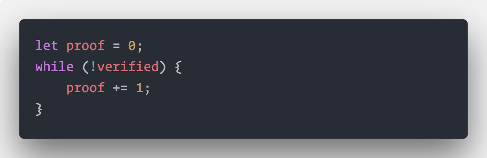

# COKE 💰

_A New Coin on the streets._

[](https://github.com/prettier/prettier) [](http://opensource.org/licenses/MIT)

**Cokecoin is a minimal Blockchain and Blockchain Server implemented in Node.**

**Works with Node 9 and above.**

### Getting Started

- `yarn` to install dependencies.
- `yarn start` to start development build with nodemon.
- `yarn build` to make production build for older node versions.
- `yarn start:prod` to start server on older node versions.
- `yarn deploy` to deploy to heroku.

### Usage

- _GET_ `/chain` to get chain.
- _POST_ `/transactions` to create transactions.

```json
{
  "sender": "Naruto",
  "recipient": "Sasuke",
  "amount": 90
}
```

- _GET_ `/mine` to mine new block.

### Internals

#### Proof of Work

- Currently using Simple Cycle until the solution is found. i.e.



#### Hasing Algo

- SHA256
- Hash-based message authentication code(HMAC) to generate hash of last block.

All the functions used are from [cypto](https://nodejs.org/api/crypto.html) included in node.

**No external dependency is used to achieve blockchain creation in node** _Only Express for HTTP server_
